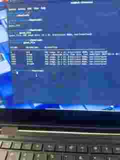

# File Carving Forensics Challenge

## Overview

This project documents a digital forensics file-carving challenge completed in Cyber Skyline. The objective was to identify an unknown file, inspect embedded data, extract a hidden archive, and recover the hidden flag.

## Tools Used

- Kali Linux
- `file`
- `binwalk`
- `dd`
- `gunzip`
- `tar`
- `cat`

## Investigation

### 1. Identify the file type

I first checked the actual file type of the downloaded evidence file:

```bash
file green_file
```

The result identified `green_file` as a PNG image.

### 2. Inspect for embedded data

Next, I used Binwalk to inspect the file for embedded signatures:

```bash
binwalk green_file
```

Binwalk identified multiple file signatures, including a gzip-compressed section beginning at byte offset `3243`.



### 3. Extract the embedded gzip data

Using the offset identified by Binwalk, I carved the gzip data from the original file:

```bash
dd if=green_file of=hidden.gz bs=1 skip=3243
```

I then verified the extracted file:

```bash
file hidden.gz
```

### 4. Decompress the data

I decompressed the gzip content into a new file:

```bash
gunzip -c hidden.gz > hidden
```

Then I identified the decompressed file:

```bash
file hidden
```

The result showed that it was a POSIX TAR archive.

### 5. Inspect and extract the TAR archive

I listed the archive contents:

```bash
tar -tf hidden
```

This revealed a directory containing a text file:

```text
flags/
flags/flags.txt
```

I extracted the archive:

```bash
tar -xf hidden
```

### 6. Recover the hidden flag

Finally, I opened the extracted text file:

```bash
cat flags/flags.txt
```

This revealed the hidden challenge flag.


## What I Learned

This challenge helped me practice:

- Identifying unknown files by their actual file signature
- Using Binwalk to locate embedded data
- Working with byte offsets during file carving
- Extracting compressed data with `dd` and `gunzip`
- Inspecting and extracting TAR archives
- Following multiple layers of hidden data during a forensic investigation

## Challenge Results

- Identified file format: PNG
- Recoverable file structures identified: 6
- Hidden flag successfully recovered

> The flag itself is intentionally omitted from the written README so the challenge answer is not directly published.
